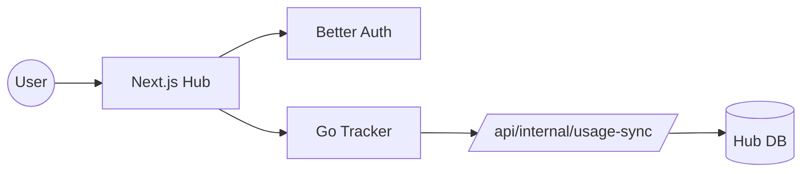

# Weightless Hub: Technical Specification

The **Weightless Hub** is the central web interface for the Weightless ecosystem. It serves as the "Hugging Face" style frontend where users can discover, verify, and download datasets.

## 1. Tech Stack
- **Framework**: Next.js 15 (App Router)
- **Authentication**: Better Auth (open-source, self-hosted)
- **Database**: Supabase or PostgreSQL (For Hub-specific data like comments, stars, and profiles)
- **Tracker Integration**: Go Tracker Registry API
- **Styling**: Vanilla CSS or Tailwind

---

## 2. Core Features

### A. Discovery & Search
- **Registry Sync**: The Hub periodically crawls or proxies the Go Tracker's `/api/registry/search` endpoint.
- **Search Filters**: Filter by publisher, category (Models/Datasets), tags, and verified status.
- **Dynamic Stats**: Show real-time seeder/leecher counts (fetched via the Registry API).

### B. Authenticated Downloads (The Seeder Economy)
- **Passkey Generation**: When a user clicks "Download," the Hub backend generates a signed HMAC passkey using the `TRACKER_SECRET`.
- **Magnet Inversion**: Injects the passkey into the `tr=` parameter of the magnet link.
- **Usage Dashboard**: Displays the user's current `downloaded` vs `uploaded` stats (synced from the Tracker).

### C. Publisher Portal
- **Dataset Registration**: A UI for uploading `.torrent` files or triggering the `wl create` workflow on the server.
- **Verified Badges**: Admin-only toggle to mark specific publishers as "Official."
- **Takedown Requests**: Interface for users to report malicious content.

---

## 3. Tracker Sync Logic (`/api/internal/usage-sync`)

The Hub must expose a secure internal endpoint for the Go Tracker to report usage deltas.

### Request Payload:
```json
{
  "user_2N7B...": { "Uploaded": 1048576, "Downloaded": 524288 },
  "user_8X2Y...": { "Uploaded": 0, "Downloaded": 209715200 }
}
```

### Backend Logic:
1. **Verify Header**: Check `X-Weightless-Key` matches the `REGISTRY_KEY`.
2. **Update Database**: Increment the `total_uploaded` and `total_downloaded` columns in the users table.
3. **Session Sync**: Update the user's session data via Better Auth for frontend access.

---

## 4. Economic Incentives

### "The Ratio Guard"
- **Grace Period**: New users start with 10GB of "Free Leech" credit.
- **Low-Ratio Warning**: If a user's ratio falls below 0.5, the Hub shows a warning: "Please seed to continue downloading."
- **The Paywall**: Users can pay a small fee (via Stripe) to "reset" their ratio or buy 1TB of download credits.

### "Passive Earning"
- Users earn **Weightless Points** for every hour they seed a "Featured" or "Low-Availability" dataset.
- Points can be redeemed for "Verified" publisher status or additional credits.

---

## 5. Deployment Architecture



- **Hub URL**: `localhost:3000`
- **Tracker URL**: `localhost:8080` (Shared `TRACKER_SECRET`)
- **Auth**: Better Auth handles user management locally — no external service dependency.
